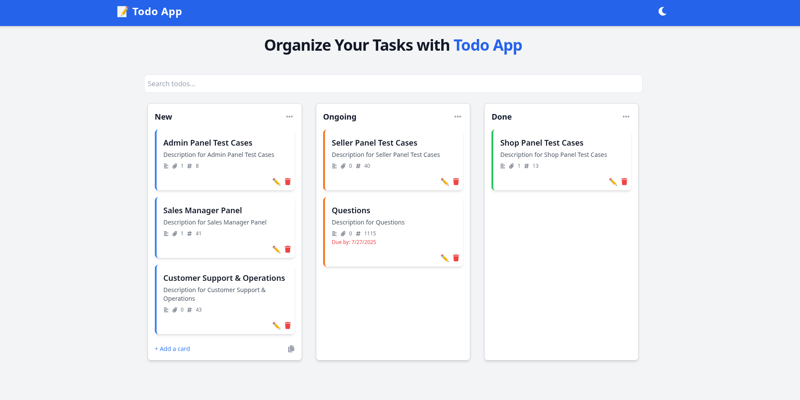
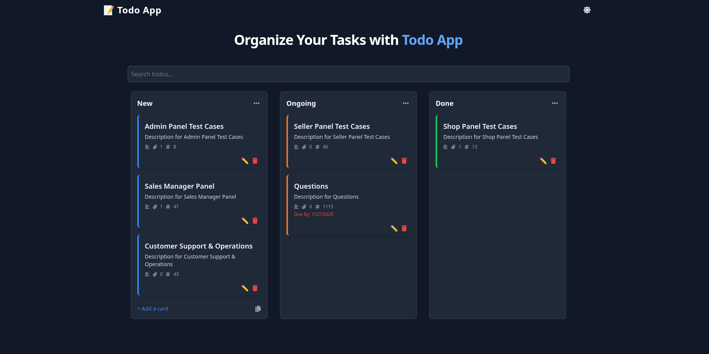

# 📝 Todo App

[](LICENSE)
[](https://github.com/HussainShafayet/todo/actions)

A modern, responsive Todo app built with React, featuring drag-and-drop, theming, and real-time search.

---

## 🚀 Live Demo

Try it now: [https://my-todo-app.vercel.app](https://my-todo-app.vercel.app)

---

## 📸 Screenshots

*Add screenshots in the `docs/screenshots` folder and update these paths accordingly.*

  


---

## Features

- Add, edit, and delete tasks with confirmation modals  
- Drag & drop tasks between `New`, `Ongoing`, and `Done` columns  
- Assign due dates using an interactive calendar picker  
- Global search to quickly find todos by title or description  
- Light/dark theme toggle with persistence via Context API  
- Responsive design for mobile and desktop devices  
- Smooth animated transitions powered by Framer Motion  
- Data persisted locally using `localStorage`  

---

## 🛠 Installation

1. Clone the repository:
    ```bash
    git clone https://github.com/HussainShafayet/todo.git
    cd todo
    ```

2. Install dependencies:
    ```bash
    npm install
    # or
    yarn
    ```

3. Start the development server:
    ```bash
    npm start
    # or
    yarn start
    ```

4. Open your browser and visit `http://localhost:3000` to view the app.

---

## Usage

- Use the **Add Todo** form to create new tasks quickly.  
- Drag tasks between columns to update their status effortlessly.  
- Right-click a todo item to open the context menu for status changes and due date assignment.  
- Use the search bar to filter todos globally across all columns.  
- Toggle between light and dark themes using the icon in the navbar.

---

## Contributing

Contributions are welcome! Please follow these steps:

1. Fork the repository  
2. Create your feature branch (`git checkout -b feature/my-feature`)  
3. Commit your changes (`git commit -m 'Add some feature'`)  
4. Push to the branch (`git push origin feature/my-feature`)  
5. Open a Pull Request

For major changes, please open an issue first to discuss what you would like to change.

---

## License

This project is licensed under the MIT License.  
© [Hussain Shafayet](https://github.com/HussainShafayet)

---

Made with ❤️ and React
